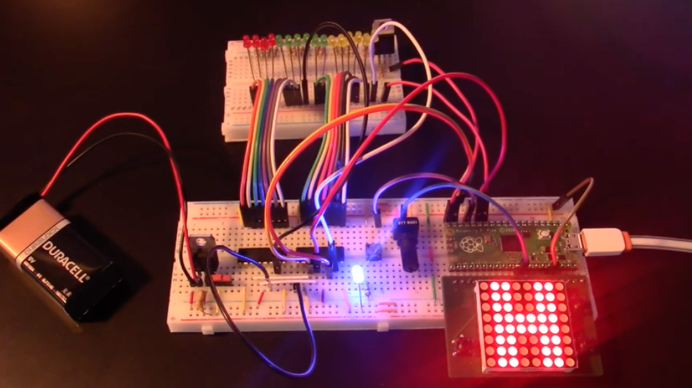

# Binary Timer (Homework 3)

In this homework you will create an interactive binary timer based on the schematics I provide. You will have to create a circuit on a breadboard and write the code on the micro:bit to control the timer.

Click on the image below to see a demo video:

<a href="https://youtu.be/W0_Qsd6zZZQ">

</a>

## Content of this folder

- [_SubmissionForm.md_](./SubmissionForm.md): the form containing the information about your submission.
- _data_: a folder with the schematics, the BOM and images use in this document.
- _README_: this file, containing the instructions.

## Getting started

The homework consists of two parts. Create the **hardware** of the circuit based on the schematics, and write the **firmware** (e.g., the MicroPython code) to make it work.

### Hardware

This is an overview of the circuit (click on the image to see a larger view in PDF format).

<a href="data/schematics.pdf">

</a>

- The **Voltage regulator** takes as input 9V from the battery and output voltage at 5V. The status LED shows the LED on when the circuit is operating.
- We use two 8-bit shift registers (74HC595) to source current to 16 LEDs (4 for hours, 6 for minutes and 6 for seconds). Use any of the methods shown in class to send data to the shift registers.
- The 16 LEDs are not connected directly to GND. Instead, there is an NPN transistor (TIP120) between the cathodes and ground. The base of the transistor is connected to pin 3 of the micro:bit, which uses PWM to modulate how all LEDs are on. The PWM value is determined by how the potentiometer (connected to P0) is rotated (from 0% to 100%).

#### Bill of Material (BOM)

| Designator | Name           | Quantity |
| ---------- | -------------- | -------- |
| J1         | MICROBIT_EDGE  | 1        |
| B1         | +9V            | 1        |
| C1,C2      | 0.1u           | 2        |
| LEDs       | Various colors | 17       |
| Q1         | TIP120         | 1        |
| R1,R3      | 2.2k           | 2        |
| R2         | 680            | 1        |
| R4...R19   | 470            | 16       |
| R20        | 326            | 1        |
| RPOT       | 100k           | 1        |
| SW1        | SPDT           | 1        |
| SW2        | Push Button    | 1        |
| U1         | LM7805         | 1        |
| U2         | SN74HC595      | 1        |
| U3         | SN74HC595      | 1        |

This is the same data in [excel format](data/BOM.xls).

Few notes:

- You can purchase any micro:bit connector. The one I used is [this one](https://www.devicemart.co.kr/goods/view?no=1360855).
- I used three colors of LEDs (_red_ for hours, _green_ for minutes, and _yellow_ for seconds and the status LED). You can use any color you want, but make sure to adjust the values of the resistors. Also make sure to use different colors for hours, minutes and seconds.
- SW1 is a SPDT. You can choose any one, but I used [this one](https://www.devicemart.co.kr/goods/view?no=2647).

### Firmware
