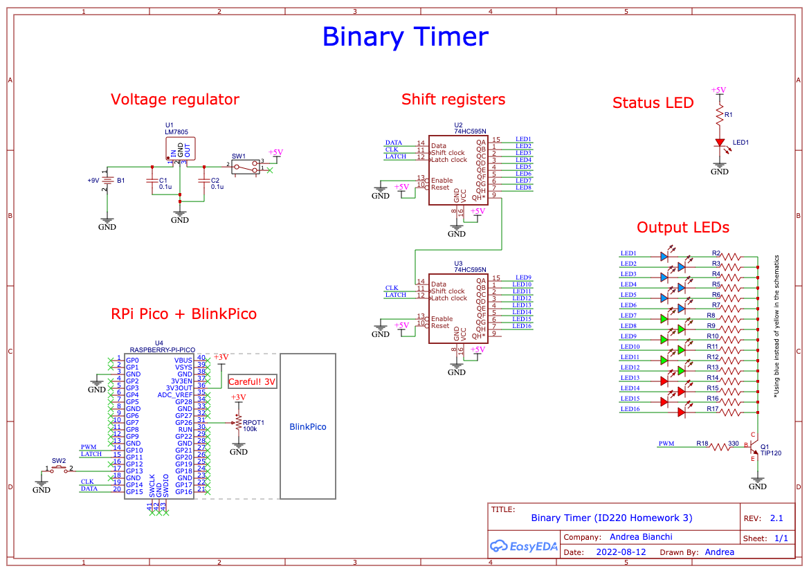

# Binary Timer (Homework 3)

In this homework you will create an interactive binary timer based on the schematics of a circuit. You will have to create a circuit on a breadboard and write the code on the micro:bit to control the timer.

Click on the image below to see a [demo video](https://youtu.be/W0_Qsd6zZZQ) of how the timer works:

<a href="https://youtu.be/W0_Qsd6zZZQ">
<p align="center">

</p>
</a>

The **objectives** of this homework are to learn:

- digital input and output, analog input and output (PWM) using micro:bit
- controlling many LEDs using shift registers
- binary numbers and binary operators

## Content of this folder

- [_SubmissionForm.md_](./SubmissionForm.md): the form containing the information about your submission.
- _data_: a folder with the schematics and images used in this document.
- _README_: this file, containing the instructions.

## How does the timer work?

<p align="center">

</p>

The timer has two modes of operation: an **input mode** to allow users to insert a specific time (hours, minutes and seconds), and a **countdown mode** that shows a countdown from the time set by the uesr to 0.

The time is displayed in binary format using an LED display (4 red LEDs for hours, 6 green LEDs for minutes and 6 yellow LEDs for seconds), controlled by a pair of shift registers placed in series.

When the micro:bit is turned on (or reset), the timer is in input mode, and the LED matrix shows `H` for hours. By clicking the `A` button, the user can cycle through minutes (`M`), seconds (`S`), and then back to hours (`H`) and so on. By clicing (or holding down) on the `B` button, the user can increment of 1 the counter of hours, minutes, seconds, depending on the current selection.

Once the user is done inputing a time, the user can click on a pushbutton to initiate the counter. The counter shows the time decreasing 1 by 1 until it reaches 0 and it stops. For the purpose of the demo, the timer counts down every 0.5 seconds.

Finally, a potentiometer allows to control the brightness of all the LEDs simultaneously, from 0 brightness (LEDs are off) to maximum brightness (LEDs fully on).

## Detailed instructions

The homework consists of two parts. Create the **hardware** of the circuit based on the schematics, and write the **firmware** (e.g., the MicroPython code) to make it work.

### Hardware

This is an overview of the circuit (click on the image to see a larger view in PDF format).

<a href="data/schematics.pdf">
<p align="center">

</p>
</a>

- The **Voltage regulator** takes as input 9V from the battery and output voltage at 5V. The status LED shows the LED on when the circuit is operating.
- We use two 8-bit shift registers (74HC595) to source current to 16 LEDs (4 for hours, 6 for minutes and 6 for seconds). Use any of the methods shown in class to send data to the shift registers.
- The 16 LEDs are not connected directly to GND. Instead, there is an NPN transistor (TIP120) between the cathodes and ground. The base of the transistor is connected to pin 3 of the micro:bit, which uses PWM to modulate how all LEDs are on. The PWM value is determined by how the potentiometer (connected to P0) is rotated (from 0% to 100%).

#### Bill of Material (BOM)

| Designator | Name           | Quantity |
| ---------- | -------------- | -------- |
| J1         | MICROBIT_EDGE  | 1        |
| B1         | +9V            | 1        |
| C1,C2      | 0.1u           | 2        |
| LEDs       | Various colors | 17       |
| Q1         | TIP120         | 1        |
| R1,R3      | 2.2k           | 2        |
| R2         | 680            | 1        |
| R4...R19   | 470            | 16       |
| R20        | 330            | 1        |
| RPOT       | 100k           | 1        |
| SW1        | SPDT           | 1        |
| SW2        | Push Button    | 1        |
| U1         | LM7805         | 1        |
| U2, U3     | SN74HC595      | 2        |

Few notes and tips:

- You can purchase any micro:bit connector. The one I used is [this one](https://www.devicemart.co.kr/goods/view?no=1360855).
- I used three colors of LEDs (_red_ for hours, _green_ for minutes, and _yellow_ for seconds and the status LED). You can use any color you want, but make sure that hours, minutes and seconds are shown with different colors. Depending on the resistors you choose, you might want to adjust the value of your resistors.
- SW1 is a SPDT. You can choose any one you want. I used [this one](https://www.devicemart.co.kr/goods/view?no=2647).
- I used two 2.2KΩ resistors (R1, R3) between the SPI pins of the micro:bit. They are optional, but I found they reduce current leakage, so I recommend you place them as well on your circuit.

### Firmware

The firmware should be written in MicroPython and should run on the micro:bit.

Here some notes and tips:

- To control the shift registers you can use any of the methods learned in class. Here a short example of how you could setup SPI on the micro:bit.

```python
# Setup SPI
spi.init(10000, 8, 0,
         sclk=pin13, mosi=pin15, miso=pin14)

# and write some value (here, for example, 0x07)
spi.write(b'\x07')
```

- You can organize the LEDs in any order you want to, but the user should see 4 LEDs for hours, 6 for minutes and 6 for seconds. This configuration allows to cover any time from 00:00:00 to 11:59:59 (the maxim time).
- Here an example of how the LEDs are mapped to time.

<p align="center">

</p>

- Use an analog pin (P0) to read the rotation of the potentiometer, and maps the value to a PWM duty cycle (on P3).

## Submission and grading

You have to submit the following items:

1. The sumbmission form containing your information and video link: [_SubmissionForm.md_](./SubmissionForm.md)
2. Clear photos of your breadboard circuit
3. Your MicroPython sketch with the code

Take clear photos of your breadboard, the [_SubmissionForm.md_](./SubmissionForm.md), and the code, zip them together (_zip_, not _ALZIP_, _rar_ or others) and submit this resulting file using the [homework submission system](https://homework.prototyping.id). Make sure the zip file is smaller than 20MB.

**DO NOT SUBMIT THE VIDEO USING THE HOMEWORK SYSTEM**. Instead, upload the video online (YouTube, Google Drive...) and place a public link to the video inside the [_SubmissionForm.md_](./SubmissionForm.md) file. The video should show a working demo of your prototype. Feeel free to use a voice-over exlaining how the system is working.

<p align="center">

</p>

Please note that:

1. Only submissions made with the system will be considered (no direct emails to TA or Prof).
2. You can re-submit as many times as you want before the deadline &ndash; we will consider your last submission.
3. Submissions after the deadline are **NOT** accepted.
4. If the file is too large the system won’t allow the submission. Remove from the zip file unnecessary files, and make sure to compress your images.
5. Do not copy from the Internet or colleagues without attribution. Remember the _honor code policy_.
